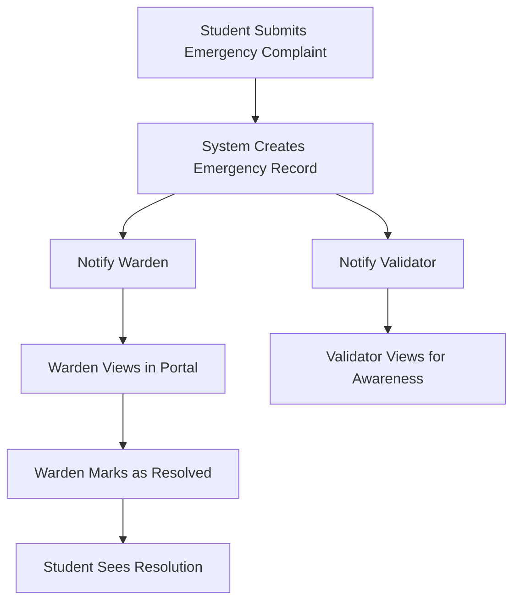

# Emergency Complaint System Design

## Overview

The Emergency Complaint System provides a streamlined workflow for urgent issues that require immediate attention. Unlike normal complaints that go through validation, priority assignment, and worker assignment, emergency complaints bypass these steps and are immediately visible to wardens and validators. Wardens can directly mark emergency complaints as resolved without additional workflow steps.

## Architecture

### High-Level Flow



### Key Differences from Normal Complaints

| Aspect | Normal Complaint | Emergency Complaint |
|--------|-----------------|---------------------|
| Validation | Required by validator | Bypassed |
| Priority Assignment | Set by validator | Not applicable |
| Worker Assignment | Required by supervisor | Not applicable |
| Resolution | Worker completes, admin verifies | Warden directly resolves |
| Workflow Steps | 5-7 steps | 2 steps (submit → resolve) |

## Components and Interfaces

### 1. Database Schema Changes

**New Column in complaints table:**
```sql
ALTER TABLE complaints ADD COLUMN is_emergency BOOLEAN DEFAULT FALSE;
```

**Emergency-specific fields:**
- `is_emergency`: Boolean flag to identify emergency complaints
- `resolved_by`: UUID reference to warden who resolved the complaint
- `resolved_at`: Timestamp of resolution

**Status values for emergency complaints:**
- `emergency`: Initial status when created
- `resolved`: Final status when warden marks as resolved

### 2. Backend API Endpoints

#### Create Emergency Complaint
```
POST /api/complaints/emergency
```

**Request Body:**
```json
{
  "title": "Emergency: Water leakage in room",
  "description": "Severe water leakage from ceiling",
  "category": "plumbing",
  "location": "Hostel A, Room 101",
  "hostel": "Hostel A",
  "room_number": "101",
  "image_url": "base64_or_url"
}
```

**Response:**
```json
{
  "message": "Emergency complaint submitted",
  "complaint": {
    "id": "uuid",
    "status": "emergency",
    "is_emergency": true,
    "created_at": "timestamp"
  }
}
```

**Logic:**
1. Validate required fields
2. Create complaint with `is_emergency: true` and `status: 'emergency'`
3. Trigger notifications to warden and validator
4. Return complaint details

#### Get Emergency Complaints (Warden)
```
GET /api/admin/complaints/emergency
```

**Query Parameters:**
- `hostel`: Filter by hostel (optional)
- `status`: Filter by status (emergency/resolved)

**Response:**
```json
{
  "complaints": [
    {
      "id": "uuid",
      "title": "Emergency: Water leakage",
      "description": "...",
      "status": "emergency",
      "is_emergency": true,
      "user_id": "uuid",
      "student_name": "John Doe",
      "hostel": "Hostel A",
      "location": "Hostel A, Room 101",
      "created_at": "timestamp"
    }
  ]
}
```

#### Resolve Emergency Complaint (Warden)
```
POST /api/admin/complaints/<complaint_id>/resolve-emergency
```

**Request Body:**
```json
{
  "resolution_notes": "Issue resolved by maintenance team"
}
```

**Response:**
```json
{
  "message": "Emergency complaint resolved",
  "complaint": {
    "id": "uuid",
    "status": "resolved",
    "resolved_by": "warden_uuid",
    "resolved_at": "timestamp"
  }
}
```

**Logic:**
1. Verify user is warden
2. Verify complaint is emergency type
3. Update status to 'resolved'
4. Set resolved_by and resolved_at
5. Create notification for student
6. Return updated complaint

#### Get Emergency Notifications
```
GET /api/notifications/emergency
```

**Response:**
```json
{
  "notifications": [
    {
      "id": "uuid",
      "complaint_id": "uuid",
      "message": "New emergency complaint in Hostel A",
      "is_read": false,
      "created_at": "timestamp"
    }
  ]
}
```

### 3. Frontend Components

#### Student Complaint Form Enhancement

**New UI Element:**
- Emergency checkbox/toggle in complaint form
- Warning message: "Emergency complaints bypass normal validation and go directly to wardens"
- Visual indicator (red border/icon) when emergency is selected

**Component Location:** `frontend/src/pages/StudentDashboard.js`

**Changes:**
```javascript
const [isEmergency, setIsEmergency] = useState(false);

// In form submission
const handleSubmit = async () => {
  const endpoint = isEmergency 
    ? '/api/complaints/emergency' 
    : '/api/complaints';
  
  // Submit to appropriate endpoint
};
```

#### Warden Portal - Emergency Section

**New Component:** `EmergencyComplaintsPanel`

**Features:**
- Separate section for emergency complaints
- List view with complaint details
- "Mark as Resolved" button for each complaint
- Resolution notes input
- Filter by hostel and status

**Component Structure:**
```javascript
function EmergencyComplaintsPanel() {
  const [emergencyComplaints, setEmergencyComplaints] = useState([]);
  const [selectedComplaint, setSelectedComplaint] = useState(null);
  const [resolutionNotes, setResolutionNotes] = useState('');
  
  // Fetch emergency complaints
  // Display in list/card format
  // Handle resolution action
}
```

**UI Layout:**
```
┌─────────────────────────────────────┐
│ Emergency Complaints                │
├─────────────────────────────────────┤
│ 🚨 Active Emergencies (3)           │
│                                     │
│ ┌─────────────────────────────────┐ │
│ │ Water Leakage - Hostel A, 101   │ │
│ │ Submitted: 2 mins ago           │ │
│ │ Student: John Doe               │ │
│ │ [View Details] [Mark Resolved]  │ │
│ └─────────────────────────────────┘ │
│                                     │
│ ✅ Resolved Emergencies (12)        │
│ [Show/Hide]                         │
└─────────────────────────────────────┘
```

#### Validator Dashboard - Emergency Awareness

**Enhancement:** Add read-only emergency complaints section

**Features:**
- View emergency complaints for awareness
- No action buttons (read-only)
- Visual indicator that these are handled by wardens
- Filter by hostel

### 4. Notification System

#### Notification Types

**Emergency Created:**
```json
{
  "type": "emergency_created",
  "recipients": ["warden_id", "validator_id"],
  "message": "New emergency complaint in {hostel}: {title}",
  "priority": "high",
  "complaint_id": "uuid"
}
```

**Emergency Resolved:**
```json
{
  "type": "emergency_resolved",
  "recipients": ["student_id"],
  "message": "Your emergency complaint has been resolved",
  "complaint_id": "uuid"
}
```

#### Notification Delivery

**Implementation Options:**
1. **Database Polling** (Current): Check notifications table every 30 seconds
2. **WebSocket** (Future): Real-time push notifications
3. **Email** (Optional): Send email for emergency notifications

**Current Implementation:**
- Store notifications in `notifications` table
- Frontend polls `/api/notifications` endpoint
- Display badge count for unread notifications
- Show notification panel with list

## Data Models

### Complaint Model (Extended)

```javascript
{
  id: UUID,
  user_id: UUID,
  title: String,
  description: String,
  category: String,
  location: String,
  hostel: String,
  room_number: String,
  status: String, // 'emergency' or 'resolved' for emergency complaints
  is_emergency: Boolean,
  image_url: String,
  resolved_by: UUID, // Warden who resolved
  resolved_at: Timestamp,
  resolution_notes: String,
  created_at: Timestamp,
  updated_at: Timestamp
}
```

### Notification Model

```javascript
{
  id: UUID,
  user_id: UUID,
  complaint_id: UUID,
  message: String,
  type: String, // 'emergency_created', 'emergency_resolved'
  is_read: Boolean,
  created_at: Timestamp
}
```

## Error Handling

### Validation Errors

**Missing Required Fields:**
```json
{
  "error": "Missing required fields: title, description, category, location",
  "status": 400
}
```

**Invalid User Role:**
```json
{
  "error": "Only wardens can resolve emergency complaints",
  "status": 403
}
```

### Business Logic Errors

**Complaint Not Found:**
```json
{
  "error": "Emergency complaint not found",
  "status": 404
}
```

**Already Resolved:**
```json
{
  "error": "This emergency complaint has already been resolved",
  "status": 400
}
```

**Not Emergency Type:**
```json
{
  "error": "This complaint is not an emergency type",
  "status": 400
}
```

### Error Handling Strategy

1. **Frontend Validation:** Check required fields before submission
2. **Backend Validation:** Verify data integrity and business rules
3. **User Feedback:** Display clear error messages in UI
4. **Logging:** Log all errors for debugging and monitoring
5. **Graceful Degradation:** Show cached data if API fails

## Testing Strategy

### Unit Tests

**Backend:**
- Test emergency complaint creation endpoint
- Test warden resolution endpoint
- Test notification creation logic
- Test role-based access control
- Test validation logic

**Frontend:**
- Test emergency toggle functionality
- Test form submission with emergency flag
- Test warden resolution action
- Test notification display

### Integration Tests

**Emergency Workflow:**
1. Student submits emergency complaint
2. Verify complaint created with correct status
3. Verify warden receives notification
4. Verify validator receives notification
5. Warden resolves complaint
6. Verify status updated to resolved
7. Verify student receives resolution notification

**Access Control:**
1. Verify only students can create emergency complaints
2. Verify only wardens can resolve emergency complaints
3. Verify validators can view but not modify emergency complaints

### Manual Testing Scenarios

**Scenario 1: Complete Emergency Flow**
1. Login as student
2. Submit emergency complaint
3. Login as warden
4. View emergency complaint
5. Mark as resolved
6. Login as student
7. Verify complaint shows as resolved

**Scenario 2: Multiple Emergencies**
1. Submit 3 emergency complaints from different students
2. Login as warden
3. Verify all 3 appear in emergency section
4. Resolve them one by one
5. Verify count updates correctly

**Scenario 3: Validator Awareness**
1. Submit emergency complaint
2. Login as validator
3. Verify complaint visible in read-only section
4. Verify no action buttons available

## Security Considerations

### Authentication & Authorization

- All endpoints require valid JWT token
- Emergency creation: Only students (role='resident')
- Emergency resolution: Only wardens (admin_role='warden')
- Emergency viewing: Wardens and validators

### Data Validation

- Sanitize all user inputs
- Validate complaint fields (title, description, category)
- Verify user belongs to specified hostel
- Check complaint ownership for student views

### Rate Limiting

- Limit emergency complaint submissions to prevent abuse
- Suggested: 5 emergency complaints per student per day
- Track submission count in session or database

## Performance Considerations

### Database Queries

**Optimized Queries:**
```sql
-- Get active emergencies for warden's hostel
SELECT c.*, u.name as student_name 
FROM complaints c
JOIN users u ON c.user_id = u.id
WHERE c.is_emergency = true 
  AND c.status = 'emergency'
  AND u.hostel = 'Hostel A'
ORDER BY c.created_at DESC;
```

**Indexes:**
```sql
CREATE INDEX idx_complaints_emergency ON complaints(is_emergency, status);
CREATE INDEX idx_complaints_hostel_emergency ON complaints(is_emergency) 
  WHERE is_emergency = true;
```

### Caching Strategy

- Cache warden's hostel assignment
- Cache emergency complaint counts
- Invalidate cache on status change

### Notification Optimization

- Batch notifications for multiple emergencies
- Use database triggers for automatic notification creation
- Implement notification queue for high volume

## Deployment Considerations

### Database Migration

```sql
-- Add emergency flag to existing complaints table
ALTER TABLE complaints 
ADD COLUMN IF NOT EXISTS is_emergency BOOLEAN DEFAULT FALSE;

-- Add resolution fields
ALTER TABLE complaints
ADD COLUMN IF NOT EXISTS resolved_by UUID REFERENCES users(id),
ADD COLUMN IF NOT EXISTS resolved_at TIMESTAMP WITH TIME ZONE,
ADD COLUMN IF NOT EXISTS resolution_notes TEXT;

-- Create index for emergency queries
CREATE INDEX IF NOT EXISTS idx_complaints_emergency 
ON complaints(is_emergency, status) 
WHERE is_emergency = true;
```

### Configuration

**Environment Variables:**
```
EMERGENCY_NOTIFICATION_ENABLED=true
EMERGENCY_EMAIL_ENABLED=false
EMERGENCY_RATE_LIMIT=5
```

### Monitoring

**Metrics to Track:**
- Number of emergency complaints per day
- Average resolution time
- Emergency complaints by hostel
- Warden response time

**Alerts:**
- Alert if emergency unresolved for > 1 hour
- Alert if emergency submission rate spikes
- Alert if warden hasn't logged in for > 4 hours

## Future Enhancements

1. **SMS Notifications:** Send SMS to warden for emergencies
2. **Escalation:** Auto-escalate to dean if unresolved for 2 hours
3. **Emergency Categories:** Predefined emergency types (fire, medical, security)
4. **Location Services:** Auto-detect student location
5. **Photo Upload:** Require photo for emergency complaints
6. **Voice Notes:** Allow voice recording for emergencies
7. **Emergency Contacts:** Display emergency contact numbers
8. **Analytics Dashboard:** Track emergency patterns and response times
